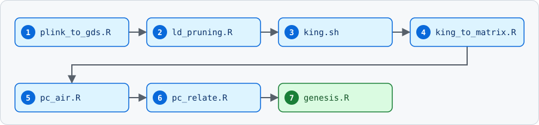

<h1 align="center">Deprivation–Brain–Disease and Genetic Analyses</h1>

<div align="center">

**Preprint:** Ebneabbasi A, Warrier V, Montagnese M, Romero Garcia R, Bethlehem RAI, Rittman T. *Mapping the Health Burden of Neighbourhood Deprivation: Neurobiological Evidence Across the Life Span.* medRxiv (2026). [https://doi.org/10.64898/2026.08.29.26361714](https://doi.org/10.64898/2026.08.29.26361714) · [Preprint page](https://www.medrxiv.org/content/10.64898/2026.08.29.26361714v1) · [PDF](https://www.medrxiv.org/content/10.64898/2026.08.29.26361714v1.full.pdf)

</div>

<p align="center">
  <a href="#computing-environment"></a>
  <a href="#software-versions"></a>
  <a href="#data-availability"></a>
  <a href="#data-processing-and-provenance"></a>
  <a href="#deprivationbraindisease-mediation"></a>
  <a href="#genetic-analysis"></a>
  <a href="#citation"></a>
  <a href="#license"></a>
</p>

---
<div align="center">
## Overview
<div>

This repository contains code for analysing relationships between neighbourhood deprivation, brain phenotypes, and disease risk across three cohorts spanning the life span:

<div align="center">

| Cohort | Sample | Age range |
|---|---|---|
| HEALthy Brain and Child Development (HBCD) Study | n = 84 | 0–4 weeks postnatal |
| Adolescent Brain Cognitive Development (ABCD) Study | n = 4,792 | 9–10 years |
| UK Biobank (UKB) | ~500,000 adults | 44–87 years |

</div>

The repository includes two main components:

1. **Deprivation–brain–disease mediation analysis** (`dep_main.py`)
2. **Genetic analysis using KING and GENESIS** (R and shell scripts)

---

## Computing environment

All analyses were run on a high-performance computing (HPC) cluster using the SLURM workload manager.

---

## Software versions

### Versions used in the study

| Software | Version | Used for |
|---|---|---|
| Python | 3.11 | Mediation and statistical analyses |
| statsmodels | 0.14.4 | Regression models |
| SNPRelate | 1.34.1 | GDS conversion and LD pruning |
| KING | 2.3.2 | Pairwise relatedness (up to third degree) |
| GENESIS | 2.30.0 | Ancestry PCs, kinship, linear mixed models |
| PC-AiR | 0.8.0 | Ancestry principal components accounting for relatedness |
| PC-Relate | 1.0.0 | Ancestry-adjusted GRM |

> [!NOTE]
> PC-AiR and PC-Relate are run through the GENESIS package (`pcair()` and `pcrelate()`).

### Example environment setup

```bash
pip install statsmodels==0.14.4 numpy pandas scipy

# R (genetic analysis) — run inside R
# if (!require("BiocManager")) install.packages("BiocManager")
# BiocManager::install(c("SNPRelate", "GENESIS"))   # target GENESIS 2.30.0, SNPRelate 1.34.1
```

KING (v2.3.2) is a standalone binary; download it from the [KING website](https://www.kingrelatedness.com/) and make sure it is on your `PATH` (or loaded as a module on your cluster).

### Installation time

> [!TIP]
> Installation typically takes about 10 minutes on a standard HPC node with internet access (Python packages ~1–2 min, KING under 1 min, R/Bioconductor packages ~5–10 min).

---

## Data availability

> [!IMPORTANT]
> Participant-level data are controlled-access and cannot be redistributed by the authors. This repository therefore contains code only.

- **ABCD and HBCD:** available to eligible researchers through the [NIH Brain Development Cohorts Data Hub](https://www.nbdc-datahub.org/), subject to approval of a Data Use Certification and completion of the required training.
- **UK Biobank:** available to eligible researchers through the [UK Biobank access process](https://www.ukbiobank.ac.uk/use-our-data/apply-for-access/).

---

## Data processing and provenance

- **HBCD:** imaging and genetic data were processed by the HBCD Study, and preprocessed data were downloaded for the present analyses.
- **UKB genetic data:** processed by the UK Biobank team.
- **ABCD and UKB imaging:** processed using FreeSurfer (v6.0.1) workflows, as described at:
  - ABCD: [ucam-department-of-psychiatry/ABCD](https://github.com/ucam-department-of-psychiatry/ABCD)
  - UKB: [ucam-department-of-psychiatry/UKB](https://github.com/ucam-department-of-psychiatry/UKB)
- **ABCD genetic quality control:** followed the pipeline at [vwarrier/ABCD_geneticQC](https://github.com/vwarrier/ABCD_geneticQC).

---

## Deprivation–brain–disease mediation

`dep_main.py` tests whether regional brain phenotypes mediate the association between neighbourhood deprivation and psychiatric or neurological disease. It runs a bootstrap mediation analysis with a **binary disease outcome** and is designed to run as a SLURM array, with each task processing a chunk of the mediation models.

### Models

```text
Brain phenotype (Mediator) ~ Deprivation (X) + Covariates                    # OLS
Disease (Y, 0/1)           ~ Deprivation (X) + Brain phenotype + Covariates   # logistic regression
```

| Quantity | Definition |
|---|---|
| `a` | Coefficient of X in the mediator model (OLS) |
| `b` | Coefficient of the mediator in the outcome model (log-odds) |
| `direct` | Coefficient of X in the outcome model, adjusted for the mediator (log-odds) |
| `indirect` | `a × b` |

### Input files

Both files must be in `--data-dir`.

**1. `mediation_info.csv`** (`--info-file`): the list of models to run, one row per model, with three required columns:

| Column | Content |
|---|---|
| `X` | Name of the deprivation column in the data file |
| `Mediator` | Name of the brain-phenotype column in the data file |
| `Y` | Name of the binary disease column in the data file |

Example (illustrative names):

```csv
X,Mediator,Y
deprivation,brain_region_1,F32
deprivation,brain_region_2,G30
```

**2. `Data_dep_brain_icd.csv`** (`--data-file`): one row per participant, with these columns:

| Column(s) | Description |
|---|---|
| X column(s) | Deprivation measure, as named in `mediation_info.csv` |
| Mediator column(s) | Brain phenotypes, as named in `mediation_info.csv` |
| Y column(s) | Binary disease indicators (1 = case, 0 = no diagnosis), as named in `mediation_info.csv` |
| `PC1` … `PC10` | Ancestry principal components |
| `site` | Imaging site |
| `sex`, `age`, `age2`, `sex_age`, `age2_sex` | Sex, age, age squared, and their sex interactions |
| `SurfaceHoles` | FreeSurfer surface-quality covariate |
| `F##` and `G##` columns | ICD-10 three-character disease indicators (for example `F32`, `G30`), coded 0/1 and used to define controls |

### Cases and controls

- **Cases:** participants with `Y == 1` and a non-missing X.
- **Controls:** participants with `0` in **every** column named `F##` or `G##` (that is, no F- or G-chapter diagnosis). This control pool is shared across all models.
- A model is skipped (`error = too_few_cases`) unless it has more than 50 cases (`--min-cases`).

### Bootstrap procedure

For each model, each of the `--n-bootstrap` replicates (default 5,000):

1. Resamples cases with replacement (same number as the observed cases).
2. Resamples controls with replacement (same number as the control pool).
3. Fits the OLS mediator model and the logistic outcome model, and stores `a`, `b`, `direct` and `indirect`.

Replicates where the models fail are skipped. For each quantity, the script reports the mean over successful replicates, a 95% percentile confidence interval, and a two-sided sign-based bootstrap p-value:

```text
p = 2 × min(n_positive, n_negative) / (n_positive + n_negative)
```

### Command-line options

| Option | Default | Description |
|---|---|---|
| `--data-dir` | `path/to/working/dir` (placeholder, so always set this) | Folder containing the input files |
| `--info-file` | `mediation_info.csv` | Model specification file |
| `--data-file` | `Data_dep_brain_icd.csv` | Analysis dataset |
| `--output-dir` | same as `--data-dir` | Where results are written |
| `--chunk-size` | 10 | Number of models per array task |
| `--n-bootstrap` | 5000 | Bootstrap replicates per model |
| `--min-cases` | 50 | Minimum cases required (must exceed this) |
| `--task-id` | `SLURM_ARRAY_TASK_ID`, else 0 | Which chunk to process |
| `--seed` | none | Random seed (each model in a chunk uses `seed + model index`) |

### Output

Each task writes `results_mediation_chunk_<task_id>.csv` with one row per model:

`X, Mediator, Y, a, b, direct, indirect`, the confidence intervals and p-values for each (`*_ci_low`, `*_ci_high`, `*_p`), `N`, `N_CASES`, `N_CONTROLS`, and `error` (empty on success).

> [!NOTE]
> Benjamini–Hochberg FDR correction is not applied by this script. Merge the chunk files and apply it across models afterwards.

---

## Genetic analysis

The goal of this pipeline is to obtain ancestry principal components (PCs) and a genetic relationship matrix (GRM) to be used as covariates in downstream analyses.

<p align="center">
  
</p>

### `plink_to_gds.R`

Converts merged autosomal PLINK files (`BED/BIM/FAM`) to GDS format using `SNPRelate`.

**Output:** `genotype_autosomes.gds`

### `ld_pruning.R`

Performs linkage disequilibrium (LD) pruning of the autosomal genotype data using `SNPRelate`. Correlation-based pruning is applied to reduce redundancy among highly correlated genetic variants.

The resulting independent SNP set is used for downstream PC-AiR and PC-Relate analyses.

**Output:** `pruned_snps.txt`

### `king.sh`

Runs KING to estimate pairwise genetic relatedness up to third-degree relatives.

**Output:** `eur_king.kin0`

### `king_to_matrix.R`

Converts KING relatedness estimates into a kinship matrix compatible with `GENESIS`.

**Output:** `eur_kinship_matrix.rds`

### `pc_air.R`

Runs PC-AiR using LD-pruned SNPs and KING relatedness estimates to obtain ancestry principal components while accounting for related individuals.

**Output:** `pc.rds`

### `pc_relate.R`

Runs PC-Relate using ancestry PCs and unrelated reference samples to estimate ancestry-adjusted genetic relatedness and construct a sparse genetic relationship matrix (GRM).

**Outputs:** `pcrelate.rds` and `pcrelate_sparse.rds`

### `genesis.R`

Runs the final GENESIS analysis for each brain phenotype using a SLURM array. It:

- fits a linear mixed model using the PC-Relate GRM
- adjusts for demographic, imaging, and PC-AiR covariates

**Outputs:** `kinship-adjusted estimates`

---

## Citation

If you use this code, please cite:

```bibtex
@article{ebneabbasi2026deprivation,
  title   = {Mapping the Health Burden of Neighbourhood Deprivation: Neurobiological Evidence Across the Life Span},
  author  = {Ebneabbasi, Amir and Warrier, Varun and Montagnese, Marcella and Romero Garcia, Rafael and Bethlehem, Richard A.I. and Rittman, Timothy},
  journal = {medRxiv},
  year    = {2026},
  doi     = {10.64898/2026.08.29.26361714}
}
```

---

## License

This repository is released under the MIT License.
